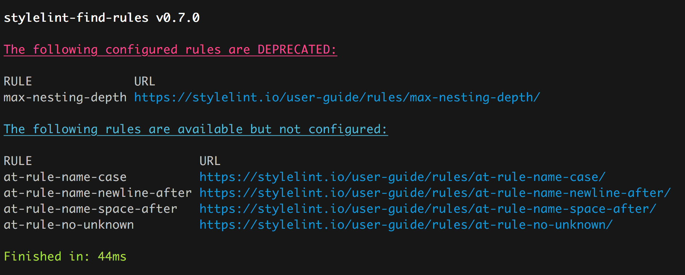

# stylelint-find-rules

[](https://circleci.com/gh/alexilyaev/stylelint-find-rules)
[](http://npm.im/stylelint-find-rules)
[](http://opensource.org/licenses/MIT)
[](https://codebeat.co/projects/github-com-alexilyaev-stylelint-find-rules-master)
[](http://makeapullrequest.com)
[](https://github.com/prettier/prettier)

Find [stylelint](https://github.com/stylelint/stylelint) rules that are not configured in your stylelint config.

> Inspired by [eslint-find-rules](https://github.com/sarbbottam/eslint-find-rules)

## Example Output



## Installation

Install as a dev dependency of your project:

```
yarn add -D stylelint-find-rules
```

Or with `npm`

```
npm i -D stylelint-find-rules
```

## Usage

This package requires `stylelint` to be already installed in the project, as it will search for
available rules from that package.

### npm script

```
{
  ...
  "scripts": {
    "stylelint-find-unused-rules": "stylelint-find-rules"
  }
  ...
}
```

### Command line

Using `npx`:

```
npx stylelint-find-rules
```

Or the old way:

```
./node_modules/.bin/stylelint-find-rules
```

### Options

```
stylelint-find-rules [options]

General:
  -h, --help  Show help                                                                    [boolean]
  --config    Optional, path to a custom config file (passed as `configPath` to cosmiconfig)

Options:
  --version         Show version number                                                    [boolean]
  -u, --unused      Find available rules that are not configured
                    To disable, set to false or use --no-u                 [boolean] [default: true]
  -d, --deprecated  Find deprecated configured rules
                    To disable, set to false or use --no-d                 [boolean] [default: true]
  -i, --invalid     Find configured rules that are no longer available
                    To disable, set to false or use --no-i                 [boolean] [default: true]
  -c, --current     Find all currently configured rules                                    [boolean]
  -a, --available   Find all available stylelint rules                                     [boolean]

Examples:
  stylelint-find-rules
  stylelint-find-rules --no-d --no-i
  stylelint-find-rules --config path/to/custom.config.js
```

## Supported configs

Just like stylelint, this package uses [cosmiconfig](https://github.com/davidtheclark/cosmiconfig)
to find your config data, so if stylelint works for you, this should too.

### Custom config file

```
./node_modules/.bin/stylelint-find-rules --config my-custom-config.js
```

### How does it handle `extends`?

The rules of `extends` are added to the list of configured rules, thus, if a rule is covered in an
extend config, it will not show up in the `unused` results.

## Contributing

See the [CONTRIBUTING](CONTRIBUTING.md) document.
